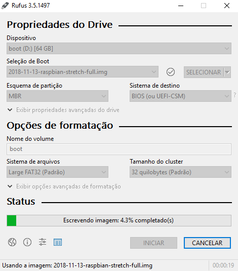

Instalar R, Shiny/RStudio Server em meu [Raspberry Pi 3](https://www.raspberrypi.org/products/raspberry-pi-3-model-b/) (a.k.a Verônica) tem sido aquele tipo de experiência ....


Em 2018, foi a primeira fez que fiz todo o ecossistema funcionar, e, realmente, (pra mim) foi bem complicado pelo fato de:

1. O Shiny Server [não possui pré-compilados](https://www.rstudio.com/products/shiny/download-server/) para distribuições linux da arquitetura ARM (processor do Raspberry);

2. Haviam pouquissimos tutoriais na internet (isso não mudou muito) e todos com suas particularidades;

3. Eu era um completo NOOB em linux (isso não mudou muito);

4. O código-fonte do Shiny Server possuia "incompatibilidades" com o Raspberry Pi 3 - Isso tornava a instalação do servidor um trabalho de formiguinha, já que era necessário entender o que deveria ser alterado em cada script.

Esse último ponto, inclusive,  me rendeu um [pull request](https://github.com/rstudio/shiny-server/pull/352) no github do [Shiny Server](https://github.com/rstudio/shiny-server) que me orgulho muito 😊  


## Chamado para Aventura

Certo dia [@pyspark2](https://twitter.com/pyspark2) aparece no zap com uma missão: Instalar o R 3.5 no Raspberry dele.  

<div style="width:100%;height:0;padding-bottom:58%;position:relative;"><iframe src="https://giphy.com/embed/ly8G39g1ujpNm" width="100%" height="100%" style="position:absolute" frameBorder="0" class="giphy-embed" allowFullScreen></iframe></div><div align="center"><p align="center">Fiquei, no mínimo, nervoso</p></div>


Prontamente, tirei Verônica da gaveta, conectei todos os cabos e... FORMATEI O CARTÃO DE MEMÓRIA.

<div style="width:100%;height:0;padding-bottom:56%;position:relative;"><iframe src="https://giphy.com/embed/d10dMmzqCYqQ0" width="100%" height="100%" style="position:absolute" frameBorder="0" class="giphy-embed" allowFullScreen></iframe></div><div align="center"><p align="center">Lembrar que eu formatei aquele microSD ainda machuca</p></div>

Bem... esse foi o inicio de um mês, reaprendendo tudo que fiz no ano passado, descobrindo aspectos que deixei passar na primeira vez, e, finalmente, registrando tudo.

<div style="width:100%;height:0;padding-bottom:56%;position:relative;"><iframe src="https://giphy.com/embed/t3Mzdx0SA3Eis" width="100%" height="100%" style="position:absolute" frameBorder="0" class="giphy-embed" allowFullScreen></iframe></div>


## Do começo

Eu não espero que você tenha instalado nada em seu Rpi.

Por isso, o primeiro passo é baixar a imagem do sistema operacional bootavel.

Minha recomendação e sistema operacional utilizado nesse post tutorial é o Raspbian Stretch que pode ser baixado [AQUI](https://www.raspberrypi.org/downloads/raspbian/)

Seja o dowload direto ZIP ou por torrent, eu recomendo a imagem 
*Raspbian Stretch with desktop and recommended software* por ter uma interface mínima e já ter alguns softwares inclusos.

Após o download da imagem, se você estiver em um Windows utilize o programa [RUFUS](https://rufus.ie/) para criar um bootavel com o cartão microSD do seu Raspberry Pi. Se você estiver em um Linux você sabe o que fazer (eu confio!).




## Primeiros Passos no Pi

Conecte o cartão microSD com a imagem bootavel em seu Raspberry Pi.

## Uma configuração inicial

A instalação  e compilação de alguns pacotes (DPLYR!!!) do R exige mais memória do que a disponível por padrão em seu Raspberry Pi.

Vamos adicionar 4GB de memória swap para evitar qualquer problemas.  

```
sudo /bin/dd if=/dev/zero of=/var/swap.1 bs=1M count=4096
sudo /sbin/mkswap /var/swap.1
sudo /sbin/swapon /var/swap.1
sudo sh -c 'echo "/var/swap.1 swap swap defaults 0 0 " >> /etc/fstab'
```

Conforme dica de [@andresrcs](https://twitter.com/andresrcs), adicionemos uma configuração para evitar o uso desnecessário de memoria SWAP. Abrindo o arquivo `sysctl.conf`:

```
sudo nano /etc/sysctl.conf
```

E adicionando o seguinte parâmetro na última linha do arquivo:

```
vm.swappiness=10
```

## Instalando R


```
sudo apt-get install -y gfortran libreadline6-dev libx11-dev libxt-dev \
       libpng-dev libjpeg-dev libcairo2-dev xvfb \
       libbz2-dev libzstd-dev liblzma-dev \
       libcurl4-openssl-dev \
       texinfo texlive texlive-fonts-extra \
       screen wget openjdk-8-jdk
```

```
sudo apt-get -y install gdebi-core  libcurl4-openssl-dev  libssl-dev  libxml2-dev libudunits2-dev libgdal-dev
```

```
cd /usr/local/src
sudo wget https://cran.rstudio.com/src/base/R-3/R-3.6.0.tar.gz
sudo su
tar zxvf R-3.6.0.tar.gz
cd R-3.6.0
./configure --with-cairo --with-jpeglib --enable-R-shlib --with-blas --with-lapack
make
make install
cd ..
rm -rf R-3.6.0*
exit
cd
```

```
sudo su - -c "R -e \"install.packages('Rcpp', repos='http://cran.rstudio.com/')\""
```


## Referências 

https://github.com/rstudio/shiny-server/wiki/Building-Shiny-Server-from-Source

https://community.rstudio.com/t/setting-up-your-own-shiny-server-rstudio-server-on-a-raspberry-pi-3b/18982

https://steemit.com/tutorial/@m4rk.h4nn4/how-to-install-and-run-shiny-server-on-the-raspberry-pi-3-and-raspian-jassie-lite

https://deanattali.com/2015/05/09/setup-rstudio-shiny-server-digital-ocean/

http://herb.h.kobe-u.ac.jp/raspiinfo/rstudio_en.html

## E se você chegou até aqui, meu muito obrigado!

<div style="width:100%;height:0;padding-bottom:58%;position:relative;"><iframe src="https://giphy.com/embed/5wWf7GW1AzV6pF3MaVW" width="100%" height="100%" style="position:absolute" frameBorder="0" class="giphy-embed" allowFullScreen></iframe></div>


<script type="text/x-mathjax-config">
MathJax.Hub.Config({
  tex2jax: {inlineMath: [['$','$'], ['\\(','\\)']]}
});
</script>

<script type="text/javascript" async
  src="https://cdn.mathjax.org/mathjax/latest/MathJax.js?config=TeX-MML-AM_CHTML">
</script>