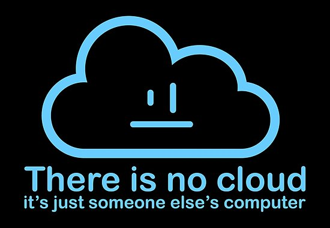
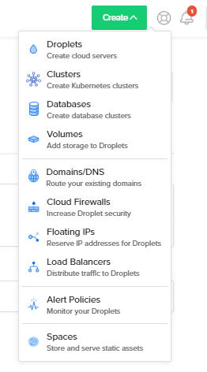
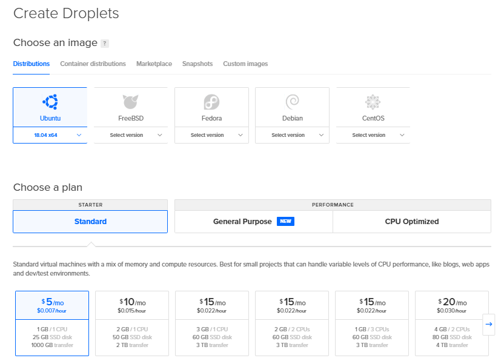
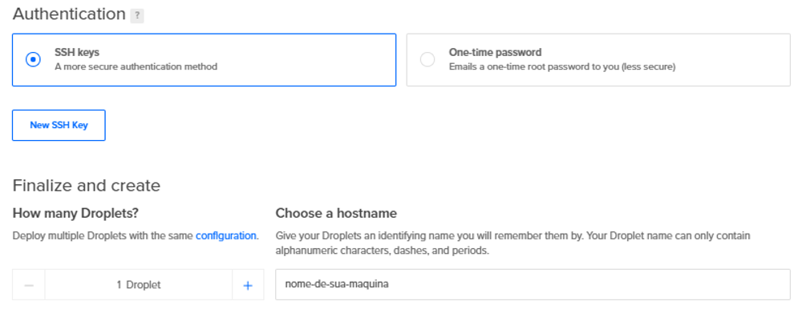
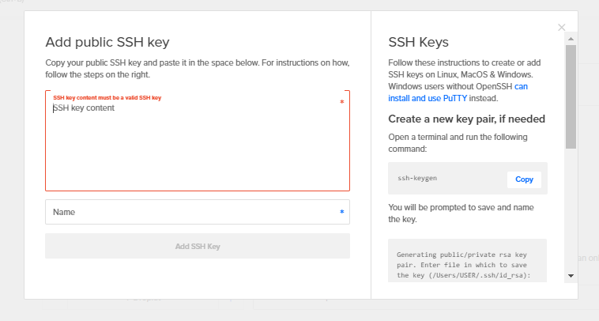
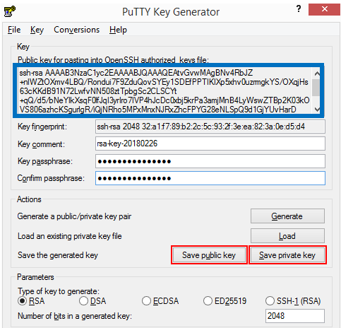

É muita ousadia em um subtítulo só.

Então, vamos dividir em partes essa missão.

Este vai ser o primeiro post de uma série voltada para a infraestrutura de ciência de dados.

A ideia é apresentar as principais ferramentas de um pipeline moderno para análise de dados e como as instalar e configurar.

## Começando do zero

Nos cursos online, tutoriais, datacamps e afins, é comum desenvolvermos análises de dados em nossos próprios computadores. 

Infelizmente, seja ao lidar com grandes volumes de dados, na implementação de modelos, ou na criação de um [API](https://pt.wikipedia.org/wiki/Interface_de_programa%C3%A7%C3%A3o_de_aplica%C3%A7%C3%B5es), o desenvolvimento e disponibilização dos produtos criados não serão realizados em máquinas locais.

Quando se fala de infraestrutura (infra, pros íntimos), falamos de todo ferramental disponibilizado para o cientista de dados trabalhar. 

Isso inclui um servidor (físico ou na cloud), softwares para processamento e armazenamento dos dados, ferramentas para modelagem e visualização, segurança, versionamento e backup.

Como **não** sou da computação, sei que muitos conceitos e procedimentos que serão apresentados não são habituais para quem não é da área. 

Por esta razão, vou elencar, ao longo do texto, referências auxiliares ao "porquê" e ao "porque" de fazermos o que vamos apresentar.

## Levantando uma máquina

Temos diversos provedores de servidores cloud no mercado: Google Cloud Plataform (GCP), Amazon Web Services (AWS), Microsoft Azure.

Para nossa proposta, usaremos a [Digital Ocean](https://www.digitalocean.com/).

Já trabalhei e trombei com as outras plataformas, mas tenho grande consideração pela DO pela enorme quantidade de tutoriais e guias que a comunidade desenvolve para seus usuários.

Crie um login na [Digital Ocean](https://cloud.digitalocean.com/registrations/new). Um cartão de crédito será pedido para cobrança pelo uso das máquinas, mas nossa pretensão será de gastar até 5 dólares por mês.

Após terminar o cadastro e fazer o login, aperte no botão "Create" na barra superior do site, e selecione a primeira opção: **Droplets**

Crie sua máquina com as configurações da imagem abaixo:

Mantenha as demais opções marcadas (ou desmarcadas) conforme a opção padrão do Digital Ocean.

Finalmente, informe que será utilizada uma chave SSH e informe o nome de sua máquina no campo "Choose a hostname".

Aperte no botão "New SSH Key" para adicionar uma chave SSH à sua máquina:

Caso já possua, adicione a chave pública no espaço disponível.

Caso precise criar, e seja usuário linux, a barra lateral da janela possui as instruções para criar sua chave SSH.

Para usuários de windows, a alternativa mais prática é a de utilizar o software [putty](https://www.chiark.greenend.org.uk/~sgtatham/putty/latest.html).

As instruções para criar a chave SSH via putty estão descritas e ilustradas no guia da [Configr](https://configr.com/ajuda/como-criar-uma-chave-ssh-usando-putty/)

No final do processo via putty, salve as chaves pública e privada (destacadas em vermelho) e copie o texto da chave pública (destacado em azul para a o digital ocean - tela na imagem anterior)

Não deixe de adicionar uma senha a sua chave SSH !!!

Com todos estes passos completados, podemos criar nossa máquina pelo botão "Create Droplet" no fim da página.

