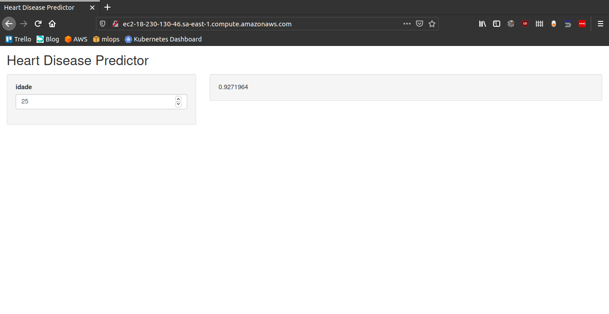

MLOps é o termo da moda. 

Nessa mistura entre Machine Learning e Operações, o que encontramos são times responsáveis por criar componentes de implantação de modelos de ciência de dados e de manter em pé aqueles que já estão sendo executados.

E com o perdão da expressão: é tiro, porrada e bomba.

Um time de MLOPs utiliza de conhecimentos que vão de Docker, API, webdev, Cloud, Segurança, Redes até, veja só, machine learning. Isso sem considerar a gigantesca conexão com engenharia de dados.

E nem quero falar de governança: modelos, dados, código, pessoas, processos, mudanças, testes.

Não existem respostas prontas, nem ferramentas que cubram todo o ciclo de vida de um modelo.

Pra colocar mais água no feijão, a primeira conferência mundial do tema foi em (pasmem!) 2019.

Colocar modelos em produção não é algo novo...

Mas, colocar modelos em produção de forma rápida como um serviço escalavel é algo que estamos todos aprendendo.

Divaguei e até agora não expliquei o que quero fazer nesse post. Então vamos lá!

Vamos criar uma esteira de MLOps para servir um modelo a partir do zero com uma única condição: O modelo tem que estar em produção em todo momento, inclusive enquanto não temos todos os componentes da esteira.

Essa é a proposta!

## Habemus dados

Vamos criar uma aplicação web (nome bonito pra site) em que o usuário se informa da chance dele ter alguma doença cardiaca.

Esse tema é totalmente aleatório, busquei alguma base de dados pública e encontrei o [Heart Disease Data Set da UCI](https://archive.ics.uci.edu/ml/datasets/Heart+Disease).

Com os dados na mão, vamos criar um modelo para estimar a chance de doença cardíaca. Vamos utilizar o pacote *ranger* do R para a modelagem sem qualquer feature engineering. O que queremos é um modelo em produção o mais raṕido possível agora.

*Ahh por quê não utilizar python?*

No fim do post eu explico.

## O modelo

Para construir o modelo, usei apenas a variável *age* (idade) do banco de dados e treinei um *random forest* mantendo todos os parâmetros *default*

Os dados foram armazenados no diretório *data/* do projeto e o modelo foi salvo no diretório *models/* serializado na extensão .RDS, padrão do R.

```R
# modelling.R

library(ranger)

data <- read.csv(here::here("data/heart.csv"))

model = ranger::ranger(target ~ age, data = data)

saveRDS(model, "models/model.RDS")
```

## Interagindo com o modelo

Em nenhum momento dissemos que a aplicação web que iriamos montar não poderia ser um servidor FTP em que armazenariamos o modelo para o usuário fazer download, abrir o R em sua máquina e executar um *predict* no modelo.

Mas, isso seria bem terrível! Reduziriamos nossa audiência a uma fração muito especifíca.

Para atingir um público maior e tornar a informação do modelo atrativa, precisamos de uma interface!

O R possui como o pacote `shiny` para construção de *web apps* que tem como grandes atrativos no nosso corre:

- A abstração de todo código html, css, js envolvido nessas aplicações: tudo é código R

- O encapsulamento do frontend e backend em um único arquivo: simples execução.


De forma rápida, chegamos no seguinte código:

```R
# app.R
library(shiny)
library(ranger)

ui <- fluidPage(
    titlePanel("Heart Disease Predictor"),
    sidebarLayout(
        sidebarPanel(
            numericInput(inputId = "idade", 
                         label = "idade",
                         value = 25, 
                         min = 0,
                         max = 100,
                         step = 1)),
        mainPanel(
           wellPanel(textOutput("distPlot"))
        )
    )
)

server <- function(input, output) {

    model <- readRDS(here::here("models/model.RDS"))
    
    output$distPlot <- renderText({
        
        prediction = predict(model, data = data.frame(age = input$idade))
        prediction$predictions
        
    })
}

options(shiny.port = 4200, shiny.host = "0.0.0.0")
shinyApp(ui = ui, server = server)
```

Em termos gerais, essa aplicação shiny tem os seguintes elementos:

- Um botão em que o usuário define sua idade;
- Um paine que retorna a chance de doença cardiaca predita pelo modelo;
- A aplicação sobe na porta 80 (http) da máquina que a executa.


## Disponibilizando o modelo

Uma vez que temos o código da aplicação e o modelo que sera servido por ela, são inumeras as formas de disponibilizar essa solução.

- Gist no github
- Aplicação como um pacote R
- Compartilhando esse post com os amiguinhos
- FTP (de novo)

Em todos os casos, o usuário teria que conhecer sobre programação. E nosso objetivo é alcançar um público maior.

Então, por quê não servir nossa aplicação como um software?

Precisaremos de uma máquina com ip público e todos os softwares e pacotes necessários para executar nossa aplicação Shiny.

Como minha conta da AWS estava aberta, é lá mesmo que vai ser.

O produto primordial da AWS são suas máquinas virtuais (EC2) e eles oferecem instância de certo tamanho (memória e cpu) e configuração (sistema operacional) de graça!

Para conhecer mais sobre EC2 e como realizar essas configurações, recomendo o vídeo [Amazon EC2 Basics & Instances Tutorial](https://www.youtube.com/watch?v=iHX-jtKIVNA) do  Stephane Maarek.

O Importante é saber que temos uma máquina com ip público em que podemos executar nossa aplicação.

Mas...

## Funciona em minha máquina

A EC2 que criamos não tem os softwares que necessários para executar o R, e para agravar, é uma máquina `fedora` que consome bibliotecas da minha máquina local (Ubuntu).

Pensando em agilidade na entrega, seria penoso debugar a EC2 até conseguir compilar o R e buscar biblioteca por biblioteca (g++, libcairo, xvfb) o equivalente no fedora.

Um solução prática, é executar na EC2 um container Docker! Por **pura** coincidência já tinha um dockerfile para instalar o R 4.0.2.

```docker
FROM ubuntu:18.04

LABEL org.label-schema.license="GPL-3.0" \
      org.label-schema.vendor="mlworks" \
      maintainer="Adelmo Filho <adelmo.aguiar.filho@gmail.com>"

# Assumir defaults nas instalações 
ENV DEBIAN_FRONTEND=noninteractive

# Parâmetros da instalação

ENV R_VERSION_MAJOR=4
ENV R_VERSION_MINOR=0
ENV R_VERSION_PATCH=2
ENV CONFIGURE_OPTIONS="--with-cairo --with-jpeglib --enable-R-shlib --with-blas --with-lapack"
ENV RENV_VERSION 0.12.0

# Instalar dependências
RUN apt-get update && apt-get install -y --no-install-recommends \
    apt-utils\
    gfortran \
    git \
    g++ \
    libreadline-dev \
    libx11-dev \
    libxt-dev \
    libpng-dev \
    libjpeg-dev \
    libcairo2-dev \   
    libcurl4-openssl-dev \
    libssl-dev \ 
    libxml2-dev \
    libudunits2-dev \
    libgdal-dev \
    libbz2-dev \
    libzstd-dev \
    liblzma-dev \
    libpcre2-dev \
    locales \
    openjdk-8-jdk \
    screen \
    texinfo \
    texlive \
    vim \
    wget \
    xvfb \
&& rm -rf /var/lib/apt/lists/*

# Ajuste o locale
RUN locale-gen pt_BR.UTF-8
ENV LANG pt_BR.UTF-8
ENV LANGUAGE pt_BR.UTF-8
ENV LC_ALL pt_BR.UTF-8

# Instalar R

RUN wget https://cran.rstudio.com/src/base/R-${R_VERSION_MAJOR}/R-${R_VERSION_MAJOR}.${R_VERSION_MINOR}.${R_VERSION_PATCH}.tar.gz && \
    tar zxvf R-${R_VERSION_MAJOR}.${R_VERSION_MINOR}.${R_VERSION_PATCH}.tar.gz && \
    rm R-${R_VERSION_MAJOR}.${R_VERSION_MINOR}.${R_VERSION_PATCH}.tar.gz

WORKDIR /R-${R_VERSION_MAJOR}.${R_VERSION_MINOR}.${R_VERSION_PATCH}

RUN ./configure ${CONFIGURE_OPTIONS} && \ 
    make && \
    make install

# Instalar renv
RUN R -e "install.packages('remotes', repos = c(CRAN = 'https://cloud.r-project.org'))"
```

Para construir a imagem base, basta executar o comando `build` no diretório do arquivo dockerfile.

```s
docker build -t adelmofilho/r-base:4.0.2 .
```

Em cima da imagem `adelmofilho/r-base:4.0.2` vamos construir a imagem Docker de nossa aplicação.

```docker
FROM adelmofilho/r-base:4.0.2

WORKDIR /app

COPY renv.lock renv.lock

RUN R -e 'renv::restore()'

COPY . .

CMD Rscript app/app
```

Em termos gerais, a imagem realiza os seguintes passos:

- Cria o diretório `app/`
- Copia para a imagem o arquivo `renv.lock` que contém a lista de pacotes R utilizados para montar a aplicação.
- Instala os pacotes R (equivalente ao pip install -r requeriments.txt)
- Copia todos os arquivos do projeto
- Executa a aplicação shiny

Executamos o *build* da imagem com o comando.

```
docker build -t adelmofilho/hearth:latest .
```

Finalmente, salvamos a imagem `adelmofilho/hearth:latest` em um arquivo de extensão .tar.

```s
docker save adelmofilho/hearth:latest > hearth.tar
```

E, enviamos a imagem Docker para a máquina EC2 via `scp`.

```bash
scp -i "mlops.pem" hearth.tar ec2-user@ec2-18-230-130-46.sa-east-1.compute.amazonaws.com:~
```

A transferência levou alguns minutos por conta do tamanho da imagem (~ 2GB).

## Configurando o servidor

Usando SSH acessamos a máquina para realizar configurações adicionais.

```bash
ssh -i "mlops.pem" ec2-user@ec2-18-230-130-46.sa-east-1.compute.amazonaws.com
```

O boas-vindas da máquina confirma que entramos na EC2 que solicitamos.

```bash
Last login: Thu Sep  30 03:33:13 2020 from 231-21-286-64.dial-up.teleba.net.br

       __|  __|_  )
       _|  (     /   Amazon Linux 2 AMI
      ___|\___|___|

https://aws.amazon.com/amazon-linux-2/
```

Inicialmente, vamos instalar o docker e criar um container com nossa imagem.

```bash
sudo yum install -y docker
sudo service docker stop
sudo service docker start

sudo docker load --input hearth.tar
sudo docker run -p 80:4200 hearth
```

Da forma que foi executado, o container executa a aplicação na porta 4200 e a máquina host mapeia essa porta para a 80 (lembre-se de abrir o firewall da EC2 para conexões inbound http).

Acesse o endereço [`http://ec2-18-230-130-46.sa-east-1.compute.amazonaws.com/`](http://ec2-18-230-130-46.sa-east-1.compute.amazonaws.com/) para interagir com nossa aplicação.



## E agora?