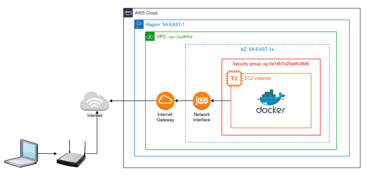
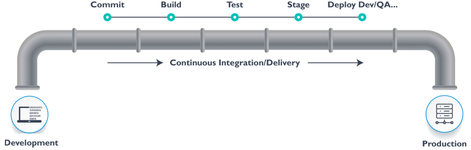
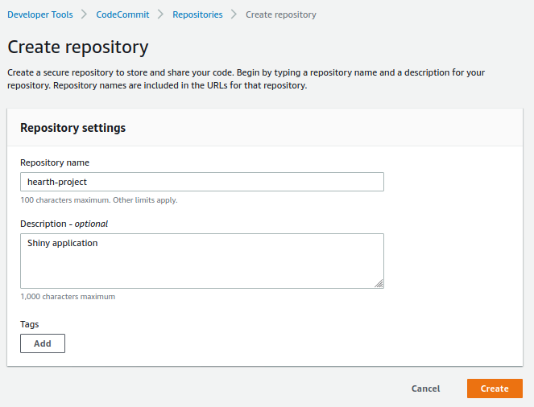

No [primeiro post desta série](https://blog.adelmofilho.com/2020-09-30-mlops1/) implantamos um modelo para a predição de chance de doença cardíaca na forma uma aplicação Shiny executado em um container docker hosteado em uma instância EC2 na AWS.



O *upload* do container com nossa aplicação e sua execução foi completamente **manual**. Enviamos arquivos via SCP e acessamos a instância EC2 via SSH.

Hoje, vamos tirar o termo *manual* do nosso projeto.

Neste post, iremos abordar as esteiras de CICD. Particulamente, meu tema favorito se tratando de MLOps.

## Se Ai Se Di 101

CICD vem de *Continuous Integration and Continuous Deployment*, que significa dizer que qualquer alteração realizado em nosso código (aplicação, modelo, infraestrutura) é promovido (deploy) de forma automatizada, controlada e monitorada.

Um processo que utiliza CICD para integrar alterações no código ao deploy se torna tão sistematico que é comum falar que estamos utilizando uma *esteira* ou *pipeline* de CICD.

Com essa esteira de CICD, desejamos que qualquer mudança na interface da aplicação ou mesmo no modelo de machine learning seja propagado de forma **transparente** (sem intervenções manuais) para a AWS.

## Versionando nossa aplicação

Diferentes tecnologias podem ser utilizada na construção de uma pipeline, dentre elas o TravisCI, Jenkins, CircleCI. Em resumo, todas elas executam uma ou mais ações em estágios alinhados sequenciamente.



O inicio de toda esteira de CICD é um repositório de código (github, gitlab, bicbucket) que utiliza algum sistema de versionamento de código, em quase unanimidade, Git.

Caso nunca tenha usado Git, pare a leitura desse post e leia sobre!

<div class="panel" style = "display: inline-block; background: #c2c0c0; padding: 5px;">
  
  <p style = "color: black">
  Git é uma tecnologia para versionamento de código e outras arquivos de texto. Ele permite acompanhar e marcar qualquer mudança realizada em seu projeto, além de facilitar o compartilhamento e contribuição entre pessoas.
  </p>
  
  <p style = "color: black">
  Para conhecer mais sobre Git, recomendo o texto <a href = "https://medium.com/@itswisdomagain/git-101-introduction-to-git-for-newbies-bb14f6f9fc1">Git 101</a>. E, para aprender a utilizar os comandos do Git, recomendo o site <a href="https://rogerdudler.github.io/git-guide/">git - the simple guide</a>.
  </p>
</div>
  
Na AWS, o serviço de versionamento de código é o [`CodeCommit`](). Vamos criar um repositório conforme as instruções da [documentação oficial](https://docs.aws.amazon.com/codecommit/latest/userguide/getting-started.html) e realizar nosso primeiro commit transferindo os arquivos que criamos no post anterior.



Clone o repositório criado, e transfira os arquivos para o diretório criado e realize um *push* para a branch master. Organizei os arquivos na seguinte estrutura.

```sh
├── app
│   └── app.R
├── credentials
│   └── mlops.pem
├── data
│   ├── processed
│   ├── raw
│   │   └── heart.csv
│   └── specialized
├── etc
│   └── mlrops.tar
├── models
│   └── model.RDS
├── R
│   └── model.R
├── renv
│   ├── library
│   ├── activate.R
│   └── settings.dcf
├── AfterInstall.sh
├── appspec.yml
├── buildspec.yml
├── Dockerfile
├── hearth.Rproj
└── renv.lock
```


