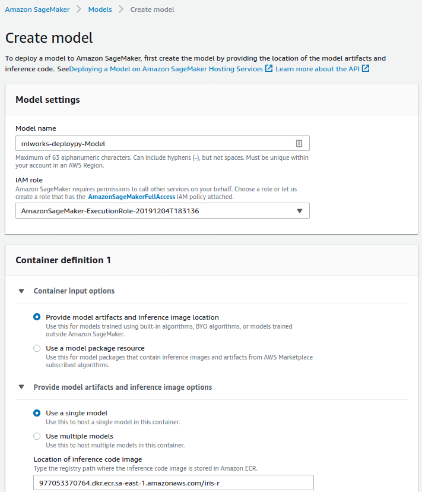

Já devo ter mais horas de discussão sobre python vs R do que *commits* no Github. E, apesar de gostar da treta, quando se trata de implantar modelos em produção, a linguagem de programação da solução não deveria um impedimento.

No paper [
Hidden Technical Debt in Machine Learning Systems](https://papers.nips.cc/paper/5656-hidden-technical-debt-in-machine-learning-systems.pdf) da Google, ao ser discutido toda complexidade envolvida em implantar um modelo, o código é apresentado como um parte diminuta frente à toda problemática existente.


E, assim, deve continuar sendo.

Pensando nisso, neste post, vamos entender como por em produção um modelo criado em R utilizando o Sagemaker - ferramenta de ML da AWS.

## Sagemaker Endpoints

O Sagemaker consiste em inúmeras APIs que procuram englobar o ciclo de vida de um modelo de Machine Learning. Encontramos soluções que vão desde o treinamento, seleção de modelos e deploy até o monitoramento e recalibração desses modelos.


Neste contexto, o deploy de modelos ocorre através dos `Sagemaker Endpoints`, serviço **gerenciado** da AWS para que permite realizar inferências (*predict*) de modelos na forma de um rest API. Por gerenciado quero dizer que toda a infraestrutura de rede, atualização das máquinas, monitoramento, até DNS é responsabilidade da AWS.

Caso você utilize o pacote python do [`Sagemaker`]() ou o [`boto3`] SDK da AWS em python, o processo de criação do endpoint a partir do modelo treinado é transparente a ponto de envolver apenas a seleção do modelo que será *deployado* e o tamanho da máquina que irá servir o modelo.

Esse processo pode ser tão transparente quanto for desejável, desde que alguns requisitos sejam atendidos.

Por baixo dos panos, um `Sagemaker Endpoint` consiste em uma máquina EC2 que executa um container docker expondo um webserver na porta 8080. Neste container estão os artefatos de modelagem (modelos e/ou dados) e códigos para lidar com as requisições ao *endpoint* e retornar o valor predito pelo modelo. Finalmente, o container deve ter um arquivo executável chamado `serve` que levanta o webserver exposto pelo endpoint.

Utilizando as soluções de prateleira do Sagemaker, nos vemos presos a containers próprios da AWS e à linguagem python, mas na minha descrição anterior em nenhum momento comento sobre qualquer de linguagem de programação.

<center>

</center>
</br>

## Preparando seu código para produção

A primeira etapa é criar uma API rest com R através do pacote [`plumber`](). O padrão dos `Sagemaker Endpoints` espera uma rota GET chamada /ping para realizar os *health checks*, e uma rota POST /invocations para obter as predições do modelo.

No código a seguir, exponho um modelo de árvores criado pelo pacote `ranger` e salvo no arquivo `model.RDS`. É importante notar que o modelo está localizado no diretório `/opt/ml/model` e que o arquivo `plumber.R` deve estar salvo no diretório `/opt/ml` (padrão do Sagemaker).

```R
# plumber.R

library(jsonlite)
library(ranger)
library(plumber)

#' Rota para avaliar a saúde da aplicação
#' @get /ping
function(res) {
    res$status <- 200
    return('')
}

#' Rota para obter a predição do modelo
#' @param req request
#' @post /invocations
function(req, res, prefix = "/opt/ml/model/") {
    res$status <- 200
    data   <- as.data.frame(jsonlite::fromJSON(req$postBody))
    model  <- readRDS(paste0(prefix, "model.RDS"))
    result <- predict(model, data = data)
    jsonlite::toJSON(result$prediction)
}
```

O código que executará o arquivo `plumber.R` deve ser chamar `serve` e conter as instruções para execução da API. Dois detalhes devem ser notados: (1) o webserver é exposto na porta 8080 e (2) o arquivo `server` é um executável Rscript.

```R
#!/usr/bin/env Rscript

serve <- function(prefix = "/opt/ml/") {
    app <- plumber::plumb(paste0(prefix, 'plumber.R'))
    app$run(host='0.0.0.0', port=8080)
}

args <- commandArgs()

if (any(grepl('serve', args))) {
    serve()}
```

Esta última condição vem do fato que o container que entregaremos ao `Sagemaker Endpoint` deve ser capaz de iniciar o webserver fazendo a seguinte chamada.

```bash
docker run -p 8080:8080 <docker-image> serve
```

Finalmente, encapsulamos toda a solução em uma imagem docker que deve ser armazenada no `Dockerhub` ou no `AWS ECR`. No arquivo Dockerfile a seguir, é apresentado um exemplo compacto dessa imagem Docker, na qual os pacotes R utilizados são instalados via pacote `renv`.

```docker
FROM adelmofilho/r-base:4.0.2 #imagem com R instalado

RUN apt-get update

RUN apt-get install -y libsodium-dev #dependencia do plumber

WORKDIR /app

COPY renv.lock renv.lock

RUN R -e "renv::restore()" #instalacao de pacotes R

COPY model.RDS /opt/ml/model/model.RDS
COPY plumber.R /opt/ml/plumber.R

COPY serve /usr/local/bin/serve #criacao do executavel
RUN chmod +x /usr/local/bin/serve

EXPOSE 8080
```

Em mãos do endereço para sua imagem docker, a criação de um `Sagemaker model` passa pela definição de um nome e da imagem docker a que faz referência.



Em seguida, crie a configuração de seu endpoint. Além do nome da configuração, adicione na configuração o modelo criado na etapa anterior.


A última etapa do processo consiste na criação do endpoint em si, que vem com a informação da configuração do endpoint criado na etapa anterior.


Uma vez finalizada a criação, uma url semelhante a `https://runtime.sagemaker.sa-east-1.amazonaws.com/endpoints/mlworks-deploypy-Endpoint/invocations` para obter as predições de nosso modelo.

## Expondo seus modelos para internet

O `Sagemaker Endpoint`, isoladamente, é acessível apenas por usuários autenticados na mesma conta da AWS em que ele foi criado. Por está razão é comum, associar a ele uma função Lambda e um API gateway para tornar seu acesso público pela internet.


Seguindo esses pontos, será possível realizar uma chamada `curl` tradicional.

```bash
curl -v -d '{"Sepal.Length":1, "Sepal.Width":2,  "Petal.Length":3, "Petal.Width":4}' -X POST https://ltchxfsiy2.execute-api.sa-east-1.amazonaws.com/predict
```
<script src="https://code.jquery.com/jquery-3.5.1.min.js" />
<script src="https://raw.githubusercontent.com/darcyclarke/Repo.js/master/repo.min.js" />


A criação da infraestrutura API gateway/Lambda está fora do escopo desse post, mas 

<script>
    $(function() {
        $('body').repo({ user: 'darcyclarke', name: 'Repo.js' })
    });
</script> 
