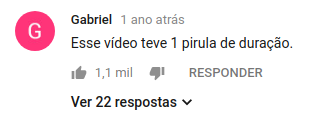
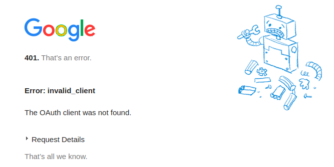

```{r setup, include=FALSE}
knitr::opts_chunk$set(echo = TRUE)

library(dplyr)
library(ggplot2)
```

Você provavelmente já se bateu com o meme "Hoje vou durmir cedo". 

<center>

<blockquote class="twitter-tweet" data-lang="en"><p lang="pt" dir="ltr">&quot;Hoje eu vou dormir cedo&quot;<br><br>3 da manhã: <a href="https://t.co/Of64NBkTzN">pic.twitter.com/Of64NBkTzN</a></p>&mdash; Carlos ↟ (@_CarlosLz) <a href="https://twitter.com/_CarlosLz/status/805593892150185985?ref_src=twsrc%5Etfw">December 5, 2016</a></blockquote>
<script async src="https://platform.twitter.com/widgets.js" charset="utf-8"></script>


</center>

Bem... foi assim minha madrugada.

**Contextualizando!**

No youtube BR, o [canal do Pirula](https://www.youtube.com/channel/UCdGpd0gNn38UKwoncZd9rmA) se destaca como um dos melhores (na minha opnião!) canais de ciência. Tratando de religião à mudança climática, o rapaz apanha da direita e da esquerda sem querer tretar com nenhum dos dois.

Ele também se destaca pela duração de seus vídeos. Praticamente, um podcast com imagens!

Basta começar um vídeo com "esse vai ser um vídeo curto" que você terá pelo menos 30 minutos de conteúdo.

Bem... eram 11h da noite quando me deparei com o seguinte comentário em um dos vídeos.

<center>


</center>

Então veio a ideia menos razoável do momento.

E você já sabe qual é...

**tl;dr**: Um pirula é igual 24 minutos!

### Extração dos dados

A informação prinicipal a ser extraída dos vídeos é a duração total deles. Com quase 500 vídeos no canal -  sem muita priori sobre a variabilidade da duração dos vídeos e podendo existir alguma característica temporal - a solução foi extrair a informação de todos os vídeos via API do youtube.

O pacote [**tuber**](https://cran.r-project.org/web/packages/tuber/tuber.pdf) realiza função de cliente para o API do youtube, facilitando em muito o nosso trabalho.

Para isso devemos criar uma chave de aplicação na plataforma de [desenvolvedores do google](https://developers.google.com/youtube/v3/getting-started), ativar o [API do youtube](https://developers.google.com/youtube/v3/) e então via tuber::yt_oauth informar a chave gerada.

```{r, eval=FALSE}
tuber::yt_oauth(app_id = "youtube", 
         app_secret = "AIzaSyBQyA88Cb1SNRhVfDjOL5rb9cujL9Lh4",
         token = "")
```

Então!

<center>




</center>

<center>
Achou que ia ser fácil? Achou erado otário!
</center>

**1h da manhã**

Após muitas tentativas, a solução foi estudar a documentação do [API do youtube](https://developers.google.com/youtube/v3/getting-started) e utilizar o pacote RJSONIO para converter a resposta das solicitações ao API em um objeto no R.

```{r, eval = FALSE}
# Id do canal do Pirula
# https://www.youtube.com/channel/UCdGpd0gNn38UKwoncZd9rmA
channel <- "UCdGpd0gNn38UKwoncZd9rmA"

# Chave do API
# https://console.developers.google.com/apis/credentials?project=a2tw-1527955801428
api_key <- "<Chave do API>"

# Requisição das informações do canal
url <- paste0("https://www.googleapis.com/youtube/v3/search?",
              "channelId=", channel,
              "&key=",api_key,
              "&part=snippet",
              "&maxResults=1",
              "&type=video")

channel_info <- fromJSON(url, simplify = FALSE)
```

A url é formada pela id do canal, a chave da API e os argumentos: part (informações a serem extraídas), maxResults, e type (filtro entre videos ou playlists).

O objeto `channel_info` acumula informações gerais tanto do canal, quanto de um único vídeo do canal (maxResults=1).

```{r, eval = FALSE}
# Número de vídeos do canal
videos_n <- channel_info$pageInfo$totalResults

# Id, nome, data de publicação e título de 1 vídeo do canal
video_id    <- channel_info$items[[1]]$id$videoId
video_time  <- substr(channel_info$items[[1]]$snippet$publishedAt, 1, 10)
video_title <- channel_info$items[[1]]$snippet$title
```

Para extrair informações detalhados do vídeo, podemos realizar a seguinte requisição ao API do youtube.

```{r, eval=FALSE}
# Requisição das informações do vídeo
url_video <- paste0("https://www.googleapis.com/youtube/v3/videos?",
                    "id=", video_id,
                    "&key=",key,
                    "&part=snippet,contentDetails,statistics,status")


video_info <- fromJSON(url_video, simplify = FALSE)
```

Com a seleção dos argumentos `contentDetails`, `statistics`,`status` extraímos dados de duração do vídeo, tags, comentários, likes e dislikes.

```{r, eval=FALSE}

# Extração da duração do vídeo e variáveis de contagem
video_duration_raw <- video_info$items[[1]]$contentDetails$duration

viewCount <-  isNull(video_info$items[[1]]$statistics$viewCount)

likeCount <- isNull(video_info$items[[1]]$statistics$likeCount)

dislikeCount <- isNull(video_info$items[[1]]$statistics$dislikeCount)

favoriteCount <- isNull(video_info$items[[1]]$statistics$favoriteCount)

commentCount <- isNull(video_info$items[[1]]$statistics$commentCount)
```

Para o caso de alguma informação retorne `NULL` e não comprometa o armazenamento dos dados, escrevi uma função isNull.

```{r, eval=FALSE}
isNull <- function(x){
  
  if (is.null(x)) { y <- NA } 
  else { y <- x }
  
  return(y)
}
```

Após a extração dos dados do primeiro vídeo, podemos navegar para o próximo utilizando a saída da requisição de nome `nextPageToken`.

```{r, eval=FALSE}
# Requisição das informações do canal (próxima página)
url <- paste0("https://www.googleapis.com/youtube/v3/search?",
                "channelId=", channel,
                "&key=",api_key,
                "&part=snippet",
                "&maxResults=1",
                "&pageToken=",channel_info$nextPageToken,
                "&type=video")
  
channel_info <- fromJSON(url, simplify = FALSE)
```

A partir deste ponto, pode-se escrever um loop (limitado pelo número de vídeos do canal) que extrai as informações do vídeo e acessa a próxima página pelo `nextPageToken` para continuar extraindo informações dos vídeos.

O Código como um todo está disponível no seguinte [Gist](https://gist.github.com/adelmofilho/cb028fc5d6dbc8e08a1695de5bfc2a54).

### Data Prep

**3h da manhã**

<center>

</center>

<br><br>

```{r, echo = FALSE}
load("~/Área de Trabalho/pirula/dados.RData")
```

Após a extração os dados tinham a seguinte cara.

```{r, echo = TRUE}
dados %>% 
  dplyr::as_tibble() %>% 
  purrr::set_names(~sub('Count', '', .x))
```

Para trabalhar com a data de publicação (`time`) e a duração do vídeo (`duration`) convertemos a primeira na classe dttm (datatime) e extraimos via regex o tempo em minutos da segunda variável.

```{r, warning=FALSE}
dados_prep <- dados %>% 
  dplyr::as_tibble() %>% 
  purrr::set_names(~sub('Count', '', .x)) %>% 
  mutate(time = lubridate::ymd(time)) %>% 
  mutate(hora = if_else(grepl("H", duration, fixed=TRUE), 
                        true = as.numeric(sub(".*PT *(.*?) *H.*", "\\1", duration)), 
                        false = 0)) %>% 
  mutate(minuto = if_else(grepl("M", duration, fixed=TRUE), 
                        true = as.numeric(sub(".*H *(.*?) *M.*", "\\1", duration)), 
                        false = 0)) %>% 
  mutate(minuto = if_else(is.na(minuto), 
                        true = as.numeric(sub(".*PT *(.*?) *M.*", "\\1", duration)), 
                        false = as.numeric(minuto))) %>% 
  mutate(segundo = if_else(grepl("S", duration, fixed=TRUE), 
                        true = as.numeric(sub(".*M *(.*?) *S.*", "\\1", duration)), 
                        false = 0)) %>% 
  mutate(total = segundo/60 + minuto + hora*60)
```

Finalmente, para termos um conjunto de dados representativo do pirula-normal (CNTP!) removemos os vídeos de Live e com participação de convidados.

```{r}
dados_clean <- dplyr::filter(dados_prep, !grepl('feat|LIVE|Live|live', title))
```

### Análise Estatística

O histograma dos tempos apresentado na imagem abaixo nos dá a perspectiva de que a distribuição é assimétrica. Tomar a média dos dados como valor representativo acabaria levando a interpretaçõs incorretas pela sua sensibilidade aos valores da cauda à direita da distribuição.

```{r, fig.align='center'}
dados_clean %>% 
  ggplot(aes(x = total)) +
  geom_histogram(col = "white", fill = "black", bins = 30) + 
  xlab("Duração do Vídeo (minutos)") +
  ylab("Quantidade")
```

O uso da mediana, pode, neste caso, ser uma alternativa razoável e que nos levaria ao pirula de duração igual a `r round(median(dados_clean$total),1)` minutos. Valor próximo ao registrado na literatura (vide Twitter hahahhahaha).

<center>

<blockquote class="twitter-tweet" data-lang="en"><p lang="pt" dir="ltr">Até onde fizeram o cálculo de todos os meus vídeos, 1 pirula = 20 minutos de duração, e não meia hora como dizem por aí. Calúnias!!</p>&mdash; Pirula #120K (@Pirulla25) <a href="https://twitter.com/Pirulla25/status/836207898527150080?ref_src=twsrc%5Etfw">February 27, 2017</a></blockquote>
<script async src="https://platform.twitter.com/widgets.js" charset="utf-8"></script>

</center>

A série temporal da duração do vídeo, contudo, revela uma tendência crescente, com o passar do tempo, da duração dos vídeos e da variabilidade deles.

```{r, fig.align= "center"}
dados_clean %>% 
  ggplot(aes(x = time, y = total)) + 
  geom_line() + geom_point(size = 0.3) + 
  xlab("Ano") + 
  ylab("Duração do Vídeo (minutos")
```

É interessante notar no gráfico de correlação abaixo que o número de views do vídeo possui baixa correlação a duração do vídeo - o que pode indicar que a audiência não treme quando vê aquele video de +45 minutos. A correlação positiva e alta (algo discutível) das visualizações com o número de likes e comentários pode estar relacionada apenas ao maior número de pessoas que consumiu o vídeo e procurou interagir ou ao fato de que vídeos maiores despertam maior interação do público - Pontos a serem investigados!

```{r, fig.align='center', message=FALSE, warning=FALSE}
dados_clean %>% 
  select(total, view, like, dislike, comment) %>% 
  mutate_all(as.numeric) %>% 
  GGally::ggpairs()
```

Finalmente, avaliamos a hipótese temporal mais detalhadamente. A imagem abaixo apresenta a mediana da duração dos vídeos agregada por ano. Podemos observar, mais claramente, como o pirula de duração varia ao longo dos anos e seus valores em anos anteriores não são mais representativos.

```{r, fig.align='center'}
dados_clean %>% 
  mutate(year = lubridate::year(time)) %>% 
  group_by(year) %>% 
  summarise(media = median(total)) %>% 
  ggplot(aes(x = year, y = media)) + 
  geom_line() + geom_point(size = 0.3) + geom_label(aes(label = round(media, 1))) +
  xlab("Ano") + ylab("Mediana da duração do vídeo")
```

Por esta razão, o pirula de duração não deve ser encarado com uma constante física e, por ainda não estar estabilizado, seu valor está atrelado ao ano de publicação dos vídeos. 

Chega-se, assim, a um valor de 24 minutos para o pirula de duração em 2018!

Obrigado por chegar até aqui guerreirinho!